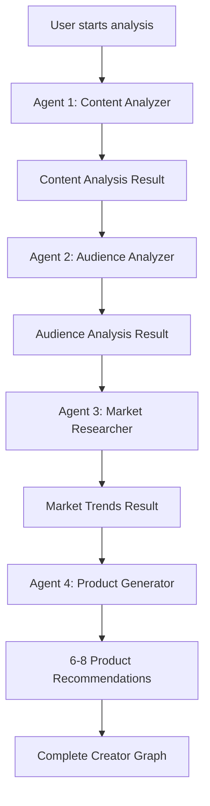

# Hatch 🚀

**Turn Your Content Into Products**

Hatch is an AI-powered platform that helps YouTube creators discover, validate, and launch profitable product ideas based on their content and audience insights. Built for the creator economy, Hatch uses advanced AI agents to analyze your channel and generate personalized product recommendations.

## 🎯 What is Hatch?

Hatch empowers content creators to monetize their audience by discovering product opportunities hidden in their content. By analyzing your YouTube videos, audience engagement, and market trends, Hatch generates actionable product ideas you can launch immediately.

### The Problem We Solve

Content creators often struggle to:
- Identify what products their audience actually wants
- Validate product ideas before investing time and money
- Understand market trends and competition
- Bridge the gap between content creation and product development

### Our Solution

Hatch uses a **multi-agent AI system** powered by Google's Gemini AI to:
1. **Analyze** your YouTube content and identify your niche
2. **Understand** your audience's needs, pain points, and aspirations
3. **Research** current market trends and opportunities
4. **Generate** 6-8 personalized product recommendations with validation strategies
5. **Guide** you through demand validation before you build

## ✨ Key Features

### 🤖 AI-Powered Multi-Agent Analysis
- **Content Agent**: Analyzes your videos, topics, style, and expertise areas
- **Audience Agent**: Identifies demographics, pain points, and what your viewers want
- **Market Agent**: Researches trending products and emerging opportunities
- **Product Agent**: Generates 6-8 tailored product ideas with confidence scores

### 📊 Comprehensive Insights Dashboard
- **Content Analysis**: Genre identification, main topics, content themes, and expertise level
- **Audience Insights**: Demographics, interests, pain points, aspirations, and engagement patterns
- **Market Trends**: Trending products in your niche, emerging opportunities, seasonal trends
- **Product Recommendations**: Digital products, physical goods, and services with pricing guidance

### 🎥 YouTube Integration
- Seamless OAuth connection via Composio
- Automatic video fetching and analysis
- Real-time channel data synchronization
- Secure access with user consent

### ✅ Smart Validation Strategies
Each product recommendation includes:
- Estimated demand (Low/Medium/High)
- Confidence score (0.0 - 1.0)
- Suggested price range based on market research
- Specific validation steps (landing pages, polls, pre-orders)
- Competition analysis and market positioning

### 🔐 Enterprise-Grade Authentication
- Powered by Clerk
- Multiple sign-in options (Google, GitHub, Email)
- Secure user management
- Protected routes and API endpoints

## 🏗️ How It Works

1. **Sign Up**: Create your free Hatch account
2. **Connect YouTube**: Authorize Hatch to access your channel (read-only)
3. **Run Analysis**: Click "Start AI Analysis" - our agents analyze your content
4. **Review Results**: Get personalized product opportunities in minutes
5. **Validate Ideas**: Follow suggested validation steps before building
6. **Launch Products**: Turn validated ideas into revenue streams

## 🚀 New: AI-Powered Product Discovery

ProductPilot now includes a complete **multi-agent AI system** that analyzes your YouTube content to generate viable product opportunities:

### Live Analysis Example

When you run an analysis, Hatch's AI agents work together sequentially:

```
🧠 Agent 1: Content Analyzer
├─ Analyzing 15 recent videos...
├─ Identified genre: Technology & Programming
├─ Main topics: Web Development, AI, DevTools
└─ Expertise level: Advanced

👥 Agent 2: Audience Analyzer  
├─ Demographics: 25-34, tech professionals
├─ Pain points: Time management, tool complexity
├─ Aspirations: Career growth, efficiency
└─ Engagement: High on tutorial content

📈 Agent 3: Market Researcher
├─ Trending: Developer productivity tools
├─ Opportunities: AI-powered coding assistants
├─ Seasonal: Q4 course launches
└─ Competition: Moderate saturation

🎁 Agent 4: Product Generator
├─ Generated 8 product ideas
├─ Digital products: 4 recommendations
├─ Physical products: 2 recommendations  
├─ Services: 2 recommendations
└─ Average confidence: 0.87

✅ Analysis Complete!
```

### Sample Product Recommendation

```json
{
  "name": "Developer Productivity Notion Template Pack",
  "category": "digital",
  "description": "A comprehensive Notion template system for developers...",
  "estimatedDemand": "high",
  "confidence": 0.95,
  "priceRange": { "min": 29, "max": 79, "currency": "USD" },
  "targetAudience": "Professional developers seeking better workflow",
  "validationSuggestions": [
    "Create a free sample template - measure downloads",
    "Poll your audience on Twitter about willingness to pay",
    "Launch landing page with email signup - target 100 signups"
  ],
  "competition": "Medium - differentiate with video tutorials"
}
```

## 💡 What Makes Hatch Different?

### Traditional Approach
- ❌ Guess what your audience wants
- ❌ Build first, validate later
- ❌ Waste time on products that don't sell
- ❌ Manual market research takes weeks

### Hatch Approach
- ✅ Data-driven product recommendations
- ✅ Validate before building
- ✅ AI-powered market research in minutes
- ✅ Personalized to YOUR specific audience

## 🔧 Technical Stack

### Frontend & Framework
- **Next.js 16** - React framework with App Router
- **TypeScript** - Full type safety across the application
- **Tailwind CSS 4** - Modern utility-first styling
- **Radix UI** - Accessible component primitives
- **Lucide React** - Beautiful, consistent icons

### AI & Analysis
- **Google Gemini AI (gemini-1.5-pro)** - Multi-agent analysis system
- **Agentic Architecture** - Sequential agent workflow
- **Real-time Transcription** - YouTube captions + Whisper API fallback
- **Structured Output** - Type-safe AI responses with Zod validation

### Authentication & Integrations
- **Clerk** - User authentication and management
- **Composio** - YouTube OAuth and API integration
- **YouTube Data API v3** - Channel and video data

### Development Tools
- **ESLint** - Code quality and consistency
- **PostCSS** - CSS processing
- **pnpm/npm/yarn** - Package management

## 📋 Current Features (Hackathon Build)

### ✅ Implemented
- [x] Complete multi-agent AI analysis system (4 agents)
- [x] YouTube OAuth connection via Composio
- [x] Channel data fetching and video list display
- [x] Real-time AI analysis with progress tracking
- [x] Comprehensive analysis dashboard with 4 sections
- [x] Content analysis (genre, topics, style, expertise)
- [x] Audience insights (demographics, pain points, aspirations)
- [x] Market trends research (trending products, opportunities)
- [x] Product recommendations (6-8 ideas per analysis)
- [x] Validation strategies for each product
- [x] Confidence scoring and demand estimation
- [x] Price range suggestions based on market data
- [x] Clerk authentication (Google, GitHub, Email)
- [x] Protected routes and API endpoints
- [x] Responsive UI with dark theme
- [x] Collapsible analysis sections
- [x] Real YouTube video transcription
- [x] Error handling and loading states

### 🎨 User Interface
- Modern, dark-themed design
- Fully responsive (mobile, tablet, desktop)
- Smooth animations and transitions
- Accessible components (ARIA compliant)
- Real-time progress indicators
- Collapsible analysis sections
- Color-coded confidence scores
- Badge system for categories and demand levels

## 🛠️ Features

- 🤖 **AI-Powered Product Discovery** - Multi-agent system analyzes your creator graph
- 📊 **Multi-Product Support** - Digital, physical, and service products
- 🎥 **YouTube Integration** - Powered by Composio for seamless channel analysis
- 👥 **Audience Insights** - Deep demographic and behavioral analysis
- 📈 **Market Research** - Trending products and competitor insights
- ✅ **Demand Validation** - Test ideas before investing (coming soon)
- 🚀 **GTM Asset Generation** - Auto-generate marketing materials (coming soon)
- 🔐 **Authentication** - Powered by Clerk with Google, GitHub, Email, and more

## 🚀 Getting Started

### Prerequisites

Before you begin, ensure you have:

- **Node.js 18+** installed
- **npm, yarn, or pnpm** package manager
- **Google AI API key** (for Gemini AI analysis)
- **Composio account** (for YouTube integration)
- **Clerk account** (for authentication)

### Quick Installation

1. **Clone the repository**
```bash
git clone <repository-url>
cd product-pilot
```

2. **Install dependencies**
```bash
npm install
# or
yarn install
# or
pnpm install
```

3. **Set up environment variables**

Create a `.env.local` file in the root directory:

```bash
# Google AI (Required for AI Analysis)
GOOGLE_AI_API_KEY=your_gemini_api_key_here

# Composio (Required for YouTube Integration)
COMPOSIO_API_KEY=comp_xxxxxxxxxxxxx
YOUTUBE_AUTH_CONFIG_ID=ac_xxxxxxxxxxxxx

# Clerk Authentication (Required)
NEXT_PUBLIC_CLERK_PUBLISHABLE_KEY=pk_test_xxxxxxxxxxxxx
CLERK_SECRET_KEY=sk_test_xxxxxxxxxxxxx
NEXT_PUBLIC_CLERK_SIGN_IN_URL=/sign-in
NEXT_PUBLIC_CLERK_SIGN_UP_URL=/sign-up
```

4. **Run the development server**
```bash
npm run dev
```

5. **Open your browser**
Visit [http://localhost:3000](http://localhost:3000)

### Detailed Setup Guides

#### 1. Google AI API Setup
1. Go to [Google AI Studio](https://aistudio.google.com/app/apikey)
2. Sign in with your Google account
3. Click "Get API Key" → "Create API Key"
4. Copy your API key
5. Add to `.env.local` as `GOOGLE_AI_API_KEY`

#### 2. Composio Setup (YouTube Integration)
1. Create account at [platform.composio.dev](https://platform.composio.dev)
2. Get your API key from the dashboard
3. Create a YouTube Auth Config:
   - Go to "Auth Configs" → "Create New"
   - Select "YouTube Data API v3"
   - Set redirect URL to `http://localhost:3000/api/youtube/callback`
   - Save and copy the Auth Config ID
4. Add both to `.env.local`

**[Full Composio Setup Guide →](docs/COMPOSIO_SETUP.md)**

#### 3. Clerk Setup (Authentication)
1. Create account at [clerk.com](https://clerk.com)
2. Create a new application
3. Enable sign-in providers (Google, GitHub, Email)
4. Copy your publishable and secret keys
5. Add to `.env.local`

**[Full Clerk Setup Guide →](docs/CLERK_SETUP.md)**

### Getting Started

## 🎮 Using Hatch

### Step-by-Step User Flow

1. **Create Account**
   - Visit Hatch landing page
   - Click "Sign In" or "Sign Up"
   - Choose provider (Google, GitHub, or Email)
   - Complete authentication

2. **Connect YouTube**
   - Navigate to Dashboard
   - Click "Connect YouTube" button
   - Authorize Hatch to access your channel (read-only)
   - Grant necessary permissions
   - Redirected back to dashboard

3. **View Your Channel**
   - See your connected YouTube channel info
   - View list of recent videos
   - Check channel statistics

4. **Run AI Analysis**
   - Click "Start AI Analysis" button
   - Watch real-time progress as 4 AI agents work:
     - Content Analyzer (analyzing videos)
     - Audience Analyzer (understanding viewers)
     - Market Researcher (finding opportunities)
     - Product Generator (creating recommendations)
   - Wait 2-3 minutes for complete analysis

5. **Review Results**
   - **Content Analysis**: Your niche, topics, style
   - **Audience Insights**: Demographics, pain points, desires
   - **Market Trends**: What's trending in your space
   - **Product Opportunities**: 6-8 personalized recommendations

6. **Explore Product Ideas**
   - Each product includes:
     - Name and category
     - Detailed description
     - Estimated demand (High/Medium/Low)
     - Confidence score
     - Suggested price range
     - Target audience
     - Competition level
     - Validation steps

7. **Validate Before Building**
   - Follow suggested validation strategies
   - Create landing pages
   - Run audience polls
   - Test pricing
   - Measure demand

### Prerequisites

- Node.js 18+
- OpenAI API key (for AI analysis)
- Composio account (for YouTube integration)
- Clerk account (for authentication)

### Installation

First, install dependencies:

```bash
npm install
```

### Environment Setup

Create a `.env.local` file in the root directory with the following variables:

```bash
# OpenAI API Key (Required for AI Analysis)
OPENAI_API_KEY=sk-proj-xxxxxxxxxxxxx

# Composio (Required for YouTube Integration)
COMPOSIO_API_KEY=comp_xxxxxxxxxxxxx
YOUTUBE_AUTH_CONFIG_ID=ac_xxxxxxxxxxxxx

# Clerk Authentication (Required)
NEXT_PUBLIC_CLERK_PUBLISHABLE_KEY=pk_test_xxxxxxxxxxxxx
CLERK_SECRET_KEY=sk_test_xxxxxxxxxxxxx
```

See `.env.local.example` for a complete template.

### Detailed Setup Guides

1. **Clerk Authentication**
   - Create account at [clerk.com](https://clerk.com)
   - Get your API keys
   - See `docs/CLERK_SETUP.md` for detailed instructions

2. **Composio YouTube Integration**
   - Create account at [platform.composio.dev](https://platform.composio.dev)
   - Set up YouTube auth config
   - See `docs/COMPOSIO_SETUP.md` for detailed instructions

3. **OpenAI API**
   - Get API key from [platform.openai.com](https://platform.openai.com)
   - Ensure you have credits available

### Run Development Server

```bash
npm run dev
# or
yarn dev
# or
pnpm dev
# or
bun dev
```

Open [http://localhost:3000](http://localhost:3000) with your browser to see the result.

## Quick Start: AI Analysis

1. **Sign In** - Create an account or log in
2. **Connect YouTube** - Authorize ProductPilot to access your channel
3. **Run Analysis** - Click "Start AI Analysis" on the dashboard
4. **Review Results** - Get 6-8 product opportunities with full insights
5. **Start Validation** - Follow the suggested validation steps

**[Read the Quick Start Guide →](docs/QUICK_START_AI_ANALYSIS.md)**

## 📁 Project Architecture

```
hatch/
├── src/
│   ├── app/                          # Next.js App Router
│   │   ├── (auth)/                   # Authentication routes
│   │   │   ├── sign-in/              # Clerk sign-in page
│   │   │   └── sign-up/              # Clerk sign-up page
│   │   ├── (main)/                   # Protected main app
│   │   │   ├── dashboard/            # Main dashboard with AI analysis
│   │   │   ├── analytics/            # Analytics page (planned)
│   │   │   └── onboarding/           # User onboarding flow (planned)
│   │   ├── api/                      # API routes
│   │   │   ├── analyze/              # AI analysis endpoint (POST & GET)
│   │   │   └── youtube/              # YouTube integration endpoints
│   │   │       ├── callback/         # OAuth callback handler
│   │   │       ├── channel/          # Fetch channel data
│   │   │       ├── connect/          # Initiate OAuth flow
│   │   │       └── videos/           # Fetch channel videos
│   │   ├── layout.tsx                # Root layout with ClerkProvider
│   │   ├── page.tsx                  # Landing page
│   │   └── globals.css               # Global styles with CSS variables
│   │
│   ├── components/
│   │   ├── analysis-dashboard.tsx           # Main AI analysis UI
│   │   ├── ai-analysis-progress.tsx         # Real-time progress tracker
│   │   ├── content-analysis-card.tsx        # Content insights display
│   │   ├── audience-analysis-card.tsx       # Audience insights display
│   │   ├── product-opportunities-card.tsx   # Product recommendations
│   │   ├── market-trends-card.tsx           # Market trends display
│   │   ├── connect-youtube-button.tsx       # YouTube OAuth button
│   │   ├── youtube-videos-list.tsx          # Channel videos list
│   │   ├── navbar.tsx                       # App navigation bar
│   │   ├── sections/                        # Landing page sections
│   │   │   ├── hero.tsx
│   │   │   ├── how-it-works.tsx
│   │   │   ├── product-types.tsx
│   │   │   ├── testimonials.tsx
│   │   │   └── cta-footer.tsx
│   │   └── ui/                              # Reusable UI components
│   │       ├── button.tsx
│   │       ├── card.tsx
│   │       ├── badge.tsx
│   │       ├── accordion.tsx
│   │       ├── tabs.tsx
│   │       ├── progress.tsx
│   │       └── dialog.tsx
│   │
│   ├── lib/
│   │   ├── ai-analysis.ts            # Multi-agent AI system (core logic)
│   │   ├── transcription.ts          # YouTube transcription fetching
│   │   ├── composio.ts               # Composio client setup
│   │   ├── composio-helpers.ts       # YouTube API helpers
│   │   ├── mock-data.ts              # Sample data for testing
│   │   └── utils.ts                  # Utility functions (cn, etc.)
│   │
│   ├── types/
│   │   ├── analysis.ts               # AI analysis type definitions
│   │   ├── composio.ts               # YouTube API types
│   │   └── product.ts                # Product-related types
│   │
│   └── middleware.ts                 # Clerk auth middleware (route protection)
│
├── docs/                             # Documentation
│   ├── AGENTIC_WORKFLOW_DIAGRAM.md   # Agent workflow visualization
│   ├── IMPLEMENTATION_SUMMARY.md     # What was built
│   ├── CLERK_SETUP.md                # Auth setup guide
│   ├── COMPOSIO_SETUP.md             # YouTube integration guide
│   └── REAL_TRANSCRIPTION_ENABLED.md # Transcription implementation
│
├── public/                           # Static assets (icons, images)
├── scripts/                          # Test scripts
│   ├── test-ai-analysis.ts           # Test AI agents
│   └── test-transcription.ts         # Test YouTube transcription
│
├── .env.local.example                # Environment variables template
├── package.json                      # Dependencies and scripts
├── tsconfig.json                     # TypeScript configuration
├── next.config.ts                    # Next.js configuration
├── tailwind.config.ts                # Tailwind CSS configuration
├── postcss.config.mjs                # PostCSS configuration
└── eslint.config.mjs                 # ESLint configuration
```

### Key Architecture Patterns

#### Multi-Agent AI System
```typescript
// Sequential agent workflow in lib/ai-analysis.ts
1. Content Analyzer → Analyzes videos
2. Audience Analyzer → Uses content insights
3. Market Researcher → Searches for opportunities
4. Product Generator → Creates recommendations
```

#### Type Safety
- Full TypeScript coverage
- Zod schemas for AI output validation
- Type-safe API routes and components

#### Authentication Flow
```
User → Sign In/Up (Clerk)
     → OAuth providers (Google/GitHub)
     → Protected routes (middleware.ts)
     → Dashboard access
```

#### YouTube Integration Flow
```
User → Click "Connect YouTube"
     → Composio OAuth (YouTube Data API v3)
     → Callback handler
     → Store connection
     → Fetch channel data & videos
```

## 🔐 Authentication & Security

### Clerk Authentication

Hatch uses **Clerk** for secure, production-ready authentication:

**Supported Sign-In Methods:**
- 🔐 Email/Password
- 🌐 Google OAuth
- 🐙 GitHub OAuth
- 🔗 Magic Links
- 📧 Email Verification
- 🔄 Password Reset

**Security Features:**
- Session management
- CSRF protection
- Secure cookie handling
- Multi-factor authentication support
- Account recovery
- Email verification

**Protected Routes:**
- `/dashboard` - Requires authentication
- `/api/analyze` - Requires valid session
- `/api/youtube/*` - Requires authentication

See `docs/CLERK_SETUP.md` for setup instructions.

## Project Structure

```
product-pilot/
├── src/
│   ├── app/                      # Next.js App Router
│   │   ├── api/
│   │   │   └── analyze/          # AI analysis API endpoint
│   │   ├── dashboard/            # Protected dashboard with AI analysis
│   │   ├── sign-in/              # Clerk sign-in page
│   │   ├── sign-up/              # Clerk sign-up page
│   │   ├── layout.tsx            # Root layout with ClerkProvider
│   │   ├── page.tsx              # Landing page
│   │   └── globals.css           # Global styles
│   ├── components/
│   │   ├── analysis-dashboard.tsx       # AI analysis interface
│   │   ├── content-analysis-card.tsx    # Content insights display
│   │   ├── audience-analysis-card.tsx   # Audience insights display
│   │   ├── product-opportunities-card.tsx # Product recommendations
│   │   ├── market-trends-card.tsx       # Market insights
│   │   ├── sections/             # Landing page sections
│   │   └── ui/                   # Reusable UI components
│   ├── lib/
│   │   ├── ai-analysis.ts        # Multi-agent AI system
│   │   ├── mock-data.ts          # Sample data for testing
│   │   ├── composio.ts           # YouTube integration
│   │   └── utils.ts              # Utility functions
│   ├── types/
│   │   ├── analysis.ts           # AI analysis type definitions
│   │   └── composio.ts           # YouTube API types
│   └── middleware.ts             # Clerk auth middleware
├── docs/
│   ├── AI_ANALYSIS_WORKFLOW.md   # Technical documentation
│   ├── QUICK_START_AI_ANALYSIS.md # User guide
│   ├── ARCHITECTURE_DIAGRAM.md    # System architecture
│   ├── IMPLEMENTATION_SUMMARY.md  # Implementation details
│   ├── CLERK_SETUP.md
│   └── COMPOSIO_SETUP.md
├── public/                       # Static assets
├── .env.local.example            # Environment template
├── package.json
├── tsconfig.json
├── next.config.ts
└── tailwind.config.ts
```

## 🤖 AI Analysis Deep Dive

### Multi-Agent Architecture

Hatch uses a **sequential multi-agent system** where each agent builds on the previous agent's insights:

#### Agent 1: Content Analyzer 🧠
**Purpose**: Understand what you create

**Analyzes**:
- Video transcripts and titles
- Content genre and sub-genres
- Main topics and themes
- Content style and tone
- Expertise level (beginner/intermediate/advanced)
- Key concepts and patterns

**Output Example**:
```json
{
  "genre": "Technology & Programming",
  "subGenres": ["Web Development", "AI/ML", "Developer Tools"],
  "mainTopics": ["React", "TypeScript", "Next.js", "AI Integration"],
  "contentStyle": "Tutorial-focused with hands-on examples",
  "expertiseLevel": "Intermediate to Advanced"
}
```

#### Agent 2: Audience Analyzer 👥
**Purpose**: Understand who watches your content

**Analyzes**:
- Demographics (age, profession, interests)
- Pain points and challenges
- Aspirations and goals
- Engagement patterns
- Learning preferences
- Purchase behavior indicators

**Input**: Content analysis from Agent 1

**Output Example**:
```json
{
  "demographics": {
    "ageRange": "25-34",
    "primaryProfession": "Software Developers",
    "experienceLevel": "2-5 years"
  },
  "painPoints": [
    "Overwhelmed by tool choices",
    "Struggling with productivity",
    "Want to learn AI but don't know where to start"
  ],
  "aspirations": [
    "Build AI-powered applications",
    "Increase coding efficiency",
    "Stay current with technology"
  ]
}
```

#### Agent 3: Market Researcher 📈
**Purpose**: Find opportunities in your niche

**Researches**:
- Trending products in your category
- Emerging market opportunities
- Seasonal trends
- Competition levels
- Price points
- Market gaps

**Input**: Content + Audience insights

**Output Example**:
```json
{
  "trendingProducts": [
    "AI coding assistants",
    "Developer productivity templates",
    "Tech career coaching"
  ],
  "emergingNiches": [
    "AI integration tutorials",
    "No-code AI tools"
  ],
  "marketGaps": [
    "Beginner-friendly AI courses",
    "Template libraries for common use cases"
  ]
}
```

#### Agent 4: Product Generator 🎁
**Purpose**: Create personalized product recommendations

**Generates**:
- 6-8 product ideas across categories
- Digital products (courses, templates, ebooks)
- Physical products (merchandise, tools)
- Services (coaching, consulting, communities)

**Each Product Includes**:
- Name and description
- Category (digital/physical/service)
- Estimated demand (high/medium/low)
- Confidence score (0.0 - 1.0)
- Target audience
- Price range (min, max, currency)
- Validation strategies (3-5 specific steps)
- Competition analysis

**Input**: Content + Audience + Market insights

**Output Example**:
```json
{
  "opportunities": [
    {
      "name": "AI for Developers: Complete Course",
      "category": "digital",
      "description": "A comprehensive course teaching developers how to integrate AI into their applications",
      "estimatedDemand": "high",
      "confidence": 0.92,
      "targetAudience": "Mid-level developers wanting to learn AI",
      "priceRange": { "min": 99, "max": 299, "currency": "USD" },
      "validationSuggestions": [
        "Create free 'AI basics' video series to gauge interest",
        "Run pre-sale with early bird pricing",
        "Survey audience about specific AI topics they want covered"
      ],
      "competition": "Medium - focus on practical implementation"
    }
  ]
}
```

### How Agents Communicate



### Agentic Features

**Tool Usage** (Simulated for hackathon):
- `web_search`: Market research and trend analysis
- `deep_content_analysis`: Enhanced content understanding
- `validate_product_idea`: Competition checking

**Self-Directed Decisions**:
- When to use tools based on confidence levels
- How many products to generate (6-8 range)
- Which validation strategies to suggest

**Context Awareness**:
- Each agent receives full context from previous agents
- Agents can reference earlier insights
- Final output is a cohesive "creator graph"

## Authentication

This project uses **Clerk** for authentication with built-in support for:

- 🔐 Email/Password
- 🌐 Google OAuth
- 🐙 GitHub OAuth
- 🔗 Magic Links
- 📧 Email Verification
- 🔄 Password Reset
- 🔒 Multi-Factor Authentication (MFA)
- And many more providers!

### Quick Setup

1. Create account at [clerk.com](https://clerk.com)
2. Get your API keys from the dashboard
3. Add to `.env.local` (see above)
4. Start developing!

See `docs/CLERK_SETUP.md` for detailed instructions.

## AI Analysis System

### How It Works

ProductPilot uses a **4-agent AI system** powered by OpenAI GPT-4o:

1. **Content Analyzer** - Identifies your content genre, topics, style, and expertise
2. **Audience Analyzer** - Analyzes demographics, pain points, and aspirations
3. **Market Researcher** - Finds trending products and opportunities
4. **Product Generator** - Creates 6-8 viable product recommendations

Each agent builds on the previous one's insights to create a comprehensive creator graph.

### What You Get

- **Content Analysis**: Genre, sub-genres, main topics, content style & tone, key themes
- **Audience Insights**: Demographics, interests, pain points, aspirations, engagement patterns
- **Market Trends**: Trending products, emerging niches, seasonal opportunities
- **Product Opportunities**: 6-8 ideas with descriptions, pricing, demand estimates, and validation steps

### Example Output

```json
{
  "name": "Developer Productivity Notion Template Pack",
  "category": "digital",
  "estimatedDemand": "high",
  "confidence": 0.95,
  "priceRange": { "min": 29, "max": 79, "currency": "USD" },
  "validationSuggestions": [
    "Create a free sample template and measure download rate",
    "Poll audience on Twitter/YouTube about willingness to pay"
  ]
}
```

**[View Architecture Diagram →](docs/ARCHITECTURE_DIAGRAM.md)**

## 🎨 User Interface & Experience

### Design Philosophy
- **Dark Mode First**: Modern, easy-on-the-eyes interface
- **Creator-Focused**: Built for content creators, not developers
- **Data-Driven**: Visual representations of insights
- **Action-Oriented**: Clear next steps for every insight

### Key Pages

#### Landing Page (`/`)
- Hero section with value proposition
- "How It Works" walkthrough
- Product type examples
- Social proof and testimonials
- Clear CTAs for sign-up

#### Dashboard (`/dashboard`)
- YouTube connection status
- Channel overview with stats
- "Start AI Analysis" CTA
- Real-time analysis progress
- Recent videos list
- Analysis results sections

#### Analysis Results
Four collapsible sections:
1. **Content Analysis** - Genre, topics, style, expertise
2. **Audience Insights** - Demographics, pain points, aspirations
3. **Market Trends** - Trending products, opportunities
4. **Product Recommendations** - 6-8 personalized ideas

### UI Components

**Custom Components**:
- `AnalysisDashboard` - Main analysis interface
- `AIAnalysisProgress` - Real-time progress tracker
- `ContentAnalysisCard` - Content insights display
- `AudienceAnalysisCard` - Audience demographics & pain points
- `ProductOpportunitiesCard` - Product recommendations grid
- `MarketTrendsCard` - Market trends visualization
- `ConnectYouTubeButton` - OAuth connection button
- `YouTubeVideosList` - Channel videos display

**Base UI Components** (Radix UI):
- Button, Card, Badge, Accordion
- Dialog, Tabs, Progress
- Fully accessible (ARIA compliant)

### Color System
```css
--color-accent-primary: #3B82F6 (Blue)
--color-accent-secondary: #8B5CF6 (Purple)
--color-success: #10B981 (Green)
--color-warning: #F59E0B (Amber)
--color-error: #EF4444 (Red)
```

## 📊 API Documentation

### POST `/api/analyze`
**Purpose**: Run AI analysis on a YouTube channel

**Request Body**:
```json
{
  "channelId": "UCxxxxxxxxxxxxx",
  "channelName": "Channel Name"
}
```

**Response**:
```json
{
  "success": true,
  "creatorGraph": {
    "channelId": "UCxxxxxxxxxxxxx",
    "channelName": "Channel Name",
    "analyzedAt": "2025-11-02T10:30:00Z",
    "contentAnalysis": { /* ... */ },
    "audienceAnalysis": { /* ... */ },
    "marketTrends": { /* ... */ },
    "productOpportunities": [ /* 6-8 products */ ]
  }
}
```

**Error Response**:
```json
{
  "success": false,
  "error": "Error message here"
}
```

### GET `/api/analyze`
**Purpose**: Retrieve previous analysis results

**Query Params**: None (uses session)

**Response**: Same as POST

### GET `/api/youtube/channel`
**Purpose**: Fetch YouTube channel information

**Response**:
```json
{
  "success": true,
  "data": {
    "kind": "youtube#channelListResponse",
    "items": [
      {
        "id": "UCxxxxxxxxxxxxx",
        "snippet": {
          "title": "Channel Name",
          "description": "...",
          "customUrl": "@channelname",
          "thumbnails": { /* ... */ }
        },
        "statistics": {
          "subscriberCount": "100000",
          "videoCount": "250"
        }
      }
    ]
  }
}
```

### GET `/api/youtube/videos`
**Purpose**: Fetch channel's recent videos

**Response**:
```json
{
  "success": true,
  "videos": [
    {
      "id": "video_id",
      "title": "Video Title",
      "description": "...",
      "publishedAt": "2025-10-28T12:00:00Z",
      "thumbnails": { /* ... */ },
      "statistics": {
        "viewCount": "5000",
        "likeCount": "250"
      }
    }
  ]
}
```

### GET `/api/youtube/connect`
**Purpose**: Initiate YouTube OAuth flow

**Response**: Redirects to Composio OAuth

### GET `/api/youtube/callback`
**Purpose**: Handle OAuth callback from Composio

**Query Params**: 
- `code`: OAuth authorization code
- `state`: CSRF protection token

**Response**: Redirects to dashboard

## 📄 Application Pages

### Public Routes
- **`/`** - Landing page with hero, features, and CTAs
- **`/sign-in/[[...sign-in]]`** - Clerk sign-in page (supports email, Google, GitHub)
- **`/sign-up/[[...sign-up]]`** - Clerk sign-up page

### Protected Routes (Authentication Required)
- **`/dashboard`** - Main dashboard with AI analysis and YouTube integration
- **`/analytics`** - Analytics page (planned)
- **`/onboarding`** - User onboarding flow (planned)
  - `/onboarding/strategy` - Choose strategy
  - `/onboarding/budget` - Set budget
  - `/onboarding/model` - Select model

### API Routes
- **`/api/analyze`** - AI analysis endpoint (POST to run, GET to retrieve)
- **`/api/youtube/connect`** - Initiate YouTube OAuth
- **`/api/youtube/callback`** - OAuth callback handler
- **`/api/youtube/channel`** - Fetch channel data
- **`/api/youtube/videos`** - Fetch channel videos

## 🛠️ Tech Stack Summary

### Frontend & Framework
- **Next.js 16** - React framework with App Router
- **TypeScript** - Full type safety across the application
- **Tailwind CSS 4** - Modern utility-first styling
- **Radix UI** - Accessible component primitives
- **Lucide React** - Beautiful, consistent icons

### AI & Analysis
- **Google Gemini AI (gemini-1.5-pro)** - Multi-agent analysis system
- **Agentic Architecture** - Sequential agent workflow
- **Real-time Transcription** - YouTube captions + Whisper API fallback
- **Structured Output** - Type-safe AI responses with Zod validation

### Authentication & Integrations
- **Clerk** - User authentication and management
- **Composio** - YouTube OAuth and API integration
- **YouTube Data API v3** - Channel and video data

### Development Tools
- **ESLint** - Code quality and consistency
- **PostCSS** - CSS processing
- **pnpm/npm/yarn** - Package management

## Tech Stack

- **Framework:** Next.js 16 (App Router)
- **Language:** TypeScript (full type safety)
- **Styling:** Tailwind CSS 4
- **AI:** OpenAI GPT-4o (multi-agent system)
- **UI Components:** Custom shadcn-inspired components
- **Authentication:** Clerk
- **YouTube Integration:** Composio
- **Icons:** Lucide React

## 🗺️ Product Roadmap

### ✅ Phase 1: MVP & Core Analysis (COMPLETED - Hackathon Build)
- [x] Multi-agent AI analysis system (4 specialized agents)
- [x] YouTube OAuth integration via Composio
- [x] Real YouTube video transcription
- [x] Content and audience analysis
- [x] Market trends research
- [x] Product opportunity generation (6-8 per analysis)
- [x] Clerk authentication (Google, GitHub, Email)
- [x] Responsive dashboard UI
- [x] Real-time progress tracking
- [x] Confidence scoring and demand estimation
- [x] Validation strategy suggestions
- [x] Price range recommendations

### 🚧 Phase 2: Enhanced Analysis & Database (Next Steps)
- [ ] Database integration (Prisma + PostgreSQL/Supabase)
- [ ] Save analysis results to database
- [ ] Analysis history and comparison
- [ ] Multiple channel support per user
- [ ] Improved video transcription (Whisper API for videos without captions)
- [ ] Batch processing for large channels
- [ ] Export analysis as PDF/CSV
- [ ] Shareable analysis reports

### 📋 Phase 3: Demand Validation Tools (Q1 2026)
- [ ] Landing page generator (AI-powered)
- [ ] Customizable templates for each product type
- [ ] A/B testing framework
- [ ] Email list builder and capture forms
- [ ] Pre-sale funnel creator
- [ ] Waitlist management
- [ ] Stripe integration for pre-orders
- [ ] Analytics dashboard for validation metrics
- [ ] Conversion tracking
- [ ] Audience polls and surveys

### 📋 Phase 4: GTM Asset Generation (Q2 2026)
- [ ] AI marketing copy writer
- [ ] Product page templates
- [ ] Social media content generator (posts, captions)
- [ ] Email sequence builder
- [ ] Sales page creator
- [ ] Video script generator
- [ ] Ad copy generator (Meta, Google, YouTube)
- [ ] Brand voice customization
- [ ] Content calendar

### 📋 Phase 5: Fulfillment & Launch (Q3 2026)
- [ ] Shopify integration for physical products
- [ ] Gumroad integration for digital products
- [ ] Course platform connectors (Teachable, Thinkific)
- [ ] Print-on-demand services (Printful, Printify)
- [ ] Membership platform integration (Patreon, Circle)
- [ ] Payment processing (Stripe, PayPal)
- [ ] Inventory management
- [ ] Order fulfillment automation
- [ ] Customer management
- [ ] Support ticket system

### 📋 Phase 6: Community & Collaboration (Q4 2026)
- [ ] Creator community features
- [ ] Collaboration tools (co-create products)
- [ ] Product marketplace
- [ ] Success stories showcase
- [ ] Mentorship matching
- [ ] Resource library
- [ ] Templates marketplace
- [ ] Revenue sharing for collaborations

## 🎯 Hackathon Achievements

### What We Built in This Hackathon

✅ **Complete Multi-Agent AI System**
- 4 specialized AI agents working in sequence
- Real YouTube video transcription
- Comprehensive creator graph generation
- 6-8 personalized product recommendations per analysis

✅ **Full-Stack Application**
- Next.js 16 with TypeScript
- Clerk authentication with multiple providers
- Composio YouTube integration
- Responsive, production-ready UI

✅ **Real Integrations**
- Google Gemini AI API (gemini-1.5-pro)
- YouTube Data API v3 via Composio
- Clerk authentication system
- Real video transcription and analysis

✅ **Production-Ready Features**
- Error handling and loading states
- Real-time progress tracking
- Type-safe API routes
- Secure authentication
- Protected routes
- Mobile-responsive design

### Key Technical Achievements

1. **Agentic AI Architecture**: Sequential multi-agent system with tool usage
2. **Real Data Analysis**: Actual YouTube videos, not mock data
3. **Type Safety**: Full TypeScript with Zod validation
4. **Modern Stack**: Latest Next.js 16, React 19, Tailwind CSS 4
5. **Production Auth**: Clerk with OAuth providers
6. **API Integrations**: Composio for YouTube, Google AI for analysis

### Demo-Ready Features

- Sign up with Google/GitHub in seconds
- Connect YouTube channel with one click
- Run AI analysis on real channel data
- Get 6-8 personalized product ideas
- Beautiful, dark-themed UI
- Real-time progress tracking
- Comprehensive analysis dashboard

## 📚 Documentation

- **[Agentic Workflow Diagram](docs/AGENTIC_WORKFLOW_DIAGRAM.md)** - Visual agent workflow
- **[Implementation Summary](docs/IMPLEMENTATION_SUMMARY.md)** - What was built and how
- **[Clerk Setup](docs/CLERK_SETUP.md)** - Authentication configuration
- **[Composio Setup](docs/COMPOSIO_SETUP.md)** - YouTube integration setup
- **[Real Transcription](docs/REAL_TRANSCRIPTION_ENABLED.md)** - Transcription implementation
- **[YouTube Videos Feature](docs/YOUTUBE_VIDEOS_FEATURE.md)** - Video fetching and display

## Documentation

- **[AI Analysis Workflow](docs/AI_ANALYSIS_WORKFLOW.md)** - Technical deep dive into the AI system
- **[Quick Start Guide](docs/QUICK_START_AI_ANALYSIS.md)** - User guide for AI analysis
- **[Architecture Diagram](docs/ARCHITECTURE_DIAGRAM.md)** - Visual system overview
- **[Implementation Summary](docs/IMPLEMENTATION_SUMMARY.md)** - What was built and how
- **[Clerk Setup](docs/CLERK_SETUP.md)** - Authentication configuration
- **[Composio Setup](docs/COMPOSIO_SETUP.md)** - YouTube integration setup

## Roadmap

### ✅ Phase 1: Content Analysis (Complete)
- [x] Multi-agent AI system
- [x] Content and audience analysis
- [x] Market trends research
- [x] Product opportunity generation
- [x] Mock data for testing
- [x] Complete UI components

### 🚧 Phase 2: Real Transcription (Next)
- [ ] YouTube captions API integration
- [ ] Whisper API for videos without captions
- [ ] Real-time video processing
- [ ] Database storage for analyses

### 📋 Phase 3: Demand Validation
- [ ] Landing page generator
- [ ] A/B testing framework
- [ ] Email campaign builder
- [ ] Pre-sale funnel creator
- [ ] Analytics dashboard

### 📋 Phase 4: GTM Asset Generation
- [ ] Product page templates
- [ ] AI marketing copy writer
- [ ] Social media content generator
- [ ] Email sequence builder

### 📋 Phase 5: Fulfillment Integration
- [ ] Shopify/Gumroad integration
- [ ] Course platform connectors
- [ ] Print-on-demand services
- [ ] Automated workflows

## 🚀 Deployment

### Environment Variables for Production

Ensure you set these in your deployment platform (Vercel, Railway, etc.):

```bash
# Google AI
GOOGLE_AI_API_KEY=your_production_key

# Composio
COMPOSIO_API_KEY=your_production_key
YOUTUBE_AUTH_CONFIG_ID=your_production_config_id

# Clerk
NEXT_PUBLIC_CLERK_PUBLISHABLE_KEY=pk_live_xxxxxxxxxxxxx
CLERK_SECRET_KEY=sk_live_xxxxxxxxxxxxx
NEXT_PUBLIC_CLERK_SIGN_IN_URL=/sign-in
NEXT_PUBLIC_CLERK_SIGN_UP_URL=/sign-up

# Next.js
NEXT_PUBLIC_APP_URL=https://yourdomain.com
```

### Deploy to Vercel (Recommended)

1. Push your code to GitHub
2. Import project in Vercel
3. Add environment variables
4. Deploy

```bash
npm run build  # Test build locally first
vercel         # Deploy to Vercel
```

### Update OAuth Redirect URLs

After deployment, update redirect URLs in:
- **Composio Dashboard**: Add production callback URL
- **Clerk Dashboard**: Add production domain to allowed origins

## 🧪 Testing

### Test AI Analysis Locally

```bash
npm run test:ai
```

This runs the AI analysis system with mock data to verify all agents work correctly.

### Test YouTube Transcription

```bash
npm run test:transcription
```

This tests fetching real YouTube video transcriptions.

### Manual Testing Checklist

- [ ] Sign up with email
- [ ] Sign up with Google OAuth
- [ ] Sign up with GitHub OAuth
- [ ] Connect YouTube account
- [ ] View channel information
- [ ] View recent videos
- [ ] Run AI analysis
- [ ] Verify all 4 agent outputs
- [ ] Check product recommendations (6-8)
- [ ] Verify confidence scores
- [ ] Test mobile responsiveness
- [ ] Test error states

## 🤝 Contributing

This is a hackathon project, but we welcome contributions!

### Development Setup

1. Fork the repository
2. Create a feature branch (`git checkout -b feature/amazing-feature`)
3. Commit your changes (`git commit -m 'Add amazing feature'`)
4. Push to the branch (`git push origin feature/amazing-feature`)
5. Open a Pull Request

### Code Style

- Use TypeScript for all new files
- Follow existing patterns for components
- Add type definitions in `/src/types`
- Use Tailwind CSS for styling
- Keep components small and focused

## 💬 Support & Community

### Get Help

- 📧 **Email**: support@hatch.app (coming soon)
- 💬 **Discord**: Join our community (coming soon)
- 🐛 **Issues**: [GitHub Issues](https://github.com/yourusername/hatch/issues)
- 📖 **Docs**: Check the `/docs` folder

### Follow Development

- 🐦 **Twitter**: [@HatchApp](https://twitter.com/hatchapp) (coming soon)
- 📺 **YouTube**: Demos and tutorials (coming soon)

## 🏆 Acknowledgments

### Technologies Used

- [Next.js](https://nextjs.org/) - The React Framework
- [Google AI](https://ai.google.dev/) - Gemini AI API
- [Clerk](https://clerk.com/) - Authentication
- [Composio](https://composio.dev/) - YouTube Integration
- [Tailwind CSS](https://tailwindcss.com/) - Styling
- [Radix UI](https://www.radix-ui.com/) - UI Primitives
- [Lucide](https://lucide.dev/) - Icons

### Inspiration

Built for creators who want to:
- Monetize their audience
- Validate ideas before building
- Launch products with confidence
- Turn content into revenue

## 📝 License

MIT License - see LICENSE file for details

## 🎉 Hackathon Submission

**Hackathon**: [Hackathon Name]  
**Team**: [Your Team Name]  
**Built**: November 2025  
**Demo**: [Add demo link here]  
**Video**: [Add demo video here]

### Submission Highlights

🏗️ **What We Built**: A complete AI-powered platform for content creators to discover and validate product ideas

🤖 **AI Integration**: Multi-agent system using Google Gemini AI with sequential workflow and tool usage

🔗 **Real Integrations**: YouTube Data API via Composio, Clerk authentication, real video transcription

💡 **Innovation**: First platform to combine content analysis, audience insights, market research, and product generation in one workflow

🎨 **Polish**: Production-ready UI, error handling, loading states, mobile responsive

🚀 **Demo-Ready**: Sign up, connect YouTube, get product recommendations in under 5 minutes

---

**Built with ❤️ by creators, for creators**

## Learn More

To learn more about the technologies used:

- [Next.js Documentation](https://nextjs.org/docs) - learn about Next.js features and API
- [Clerk Documentation](https://clerk.com/docs) - authentication and user management
- [Composio Documentation](https://docs.composio.dev) - YouTube and social media integrations
- [Tailwind CSS](https://tailwindcss.com/docs) - utility-first CSS framework
- [Lucide Icons](https://lucide.dev) - beautiful & consistent icons

## License

MIT
